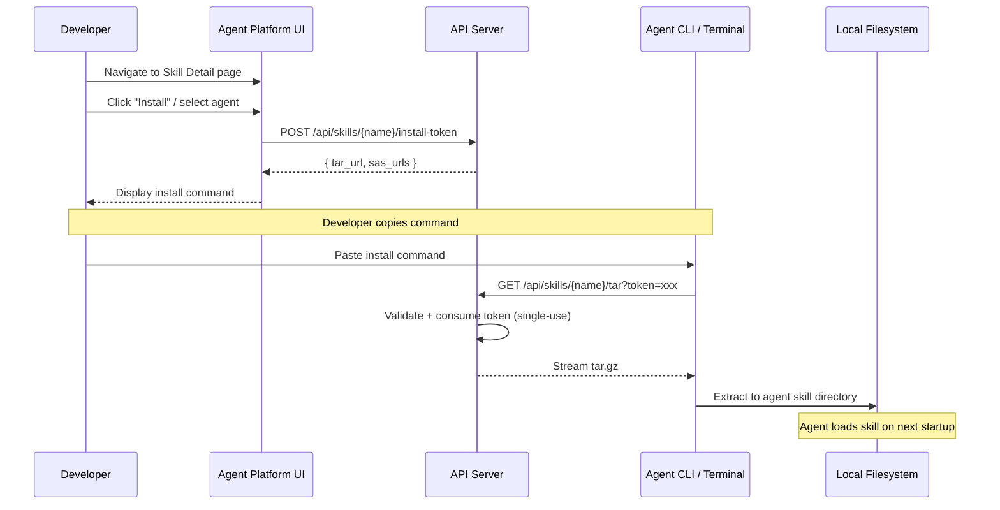

# Agent Integration

Agent Platform creates skills that are consumed by **AI coding agents**. This page explains how skills get from the platform into agent workspaces.

## Supported Agents

| Agent | Install Path (Project) | Install Path (Personal) |
|-------|----------------------|------------------------|
| Claude Code | `.claude/skills/{name}/` | `~/.claude/skills/{name}/` |
| GitHub Copilot | `.github/skills/{name}/` | — |
| Codex | `.codex/skills/{name}/` | `~/.codex/skills/{name}/` |
| Cursor | `.cursor/skills/{name}/` | `~/.cursor/skills/{name}/` |
| Windsurf | `.windsurf/skills/{name}/` | `~/.windsurf/skills/{name}/` |
| OpenCode | `.opencode/skills/{name}/` | `~/.opencode/skills/{name}/` |

## Installation Flow



## Install Commands

### Claude Code

**Project scope:**
```bash
mkdir -p .claude/skills/my-skill && curl -sL "TAR_URL" | tar -xz -C .claude/skills/my-skill
```

**Personal scope:**
```bash
mkdir -p ~/.claude/skills/my-skill && curl -sL "TAR_URL" | tar -xz -C ~/.claude/skills/my-skill
```

### GitHub Copilot

```bash
mkdir -p .github/skills/my-skill && curl -sL "TAR_URL" | tar -xz -C .github/skills/my-skill
```

### Codex

```bash
mkdir -p .codex/skills/my-skill && curl -sL "TAR_URL" | tar -xz -C .codex/skills/my-skill
```

### Cursor

```bash
mkdir -p .cursor/skills/my-skill && curl -sL "TAR_URL" | tar -xz -C .cursor/skills/my-skill
```

### Windsurf

```bash
mkdir -p .windsurf/skills/my-skill && curl -sL "TAR_URL" | tar -xz -C .windsurf/skills/my-skill
```

### OpenCode

```bash
mkdir -p .opencode/skills/my-skill && curl -sL "TAR_URL" | tar -xz -C .opencode/skills/my-skill
```

### Azure Blob Direct (azcopy)

For environments with Azure credentials available:
```bash
azcopy copy "https://{account}.blob.core.windows.net/skills-container/{tid}/{name}/*" "./{name}/" --recursive
```

## Install Token Security

The install token system bridges the gap between the platform's OAuth-based auth and CLI tools that can't do interactive OAuth flows.

| Property | Value |
|----------|-------|
| **Token format** | `secrets.token_urlsafe(32)` (256-bit) |
| **TTL** | 300 seconds (5 minutes) |
| **Usage** | Single-use (deleted on first consumption) |
| **Storage** | In-memory (process-local) |
| **Tenant isolation** | Token carries tenant_id internally |

### Security Properties

- Tokens are cryptographically random — no guessing or enumeration
- Single-use prevents replay attacks
- Short TTL limits exposure window
- Tenant ID is embedded in the token, not in the URL path — even if a token leaks, it only grants access to the creating user's tenant
- No Bearer token required for the tar endpoint — the token IS the credential

## How Agents Use Skills

Once installed, agents load skills automatically based on their conventions:

1. **Agent starts** in a project directory
2. **Agent scans** its skill directory (e.g., `.claude/skills/`)
3. **For each skill**, the agent reads `SKILL.md`:
   - Parses YAML frontmatter for metadata
   - Reads the Markdown body as behavioral instructions
4. **Agent incorporates** the skill's instructions into its context
5. **Scripts** in `scripts/` are available for the agent to execute
6. **References** in `references/` provide additional context documents

The platform has no runtime control over agents — agents are external tools that independently read the skill files from disk.

## Cross-Agent Compatibility

The agentskills.io standard ensures skills work across all supported agents. The key compatibility contract:

- `SKILL.md` must exist at the root
- Frontmatter must follow the schema (name, description, etc.)
- Agents must be able to read Markdown instructions
- Scripts should be executable by the agent's runtime (Python is the most common)

If a skill uses agent-specific features, the `compatibility` frontmatter field should document which agents are supported.
