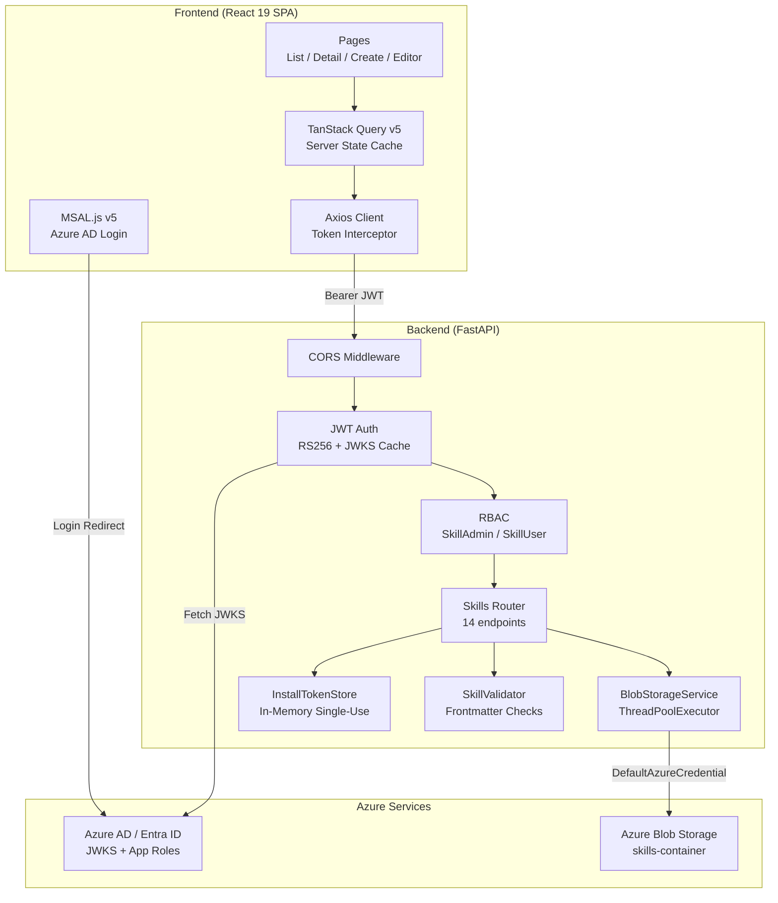
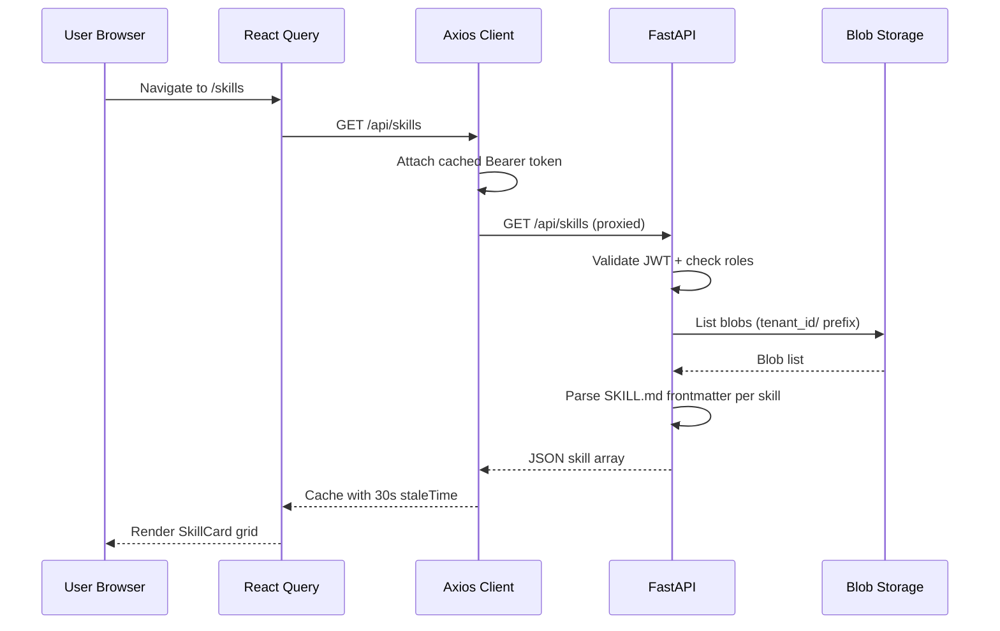
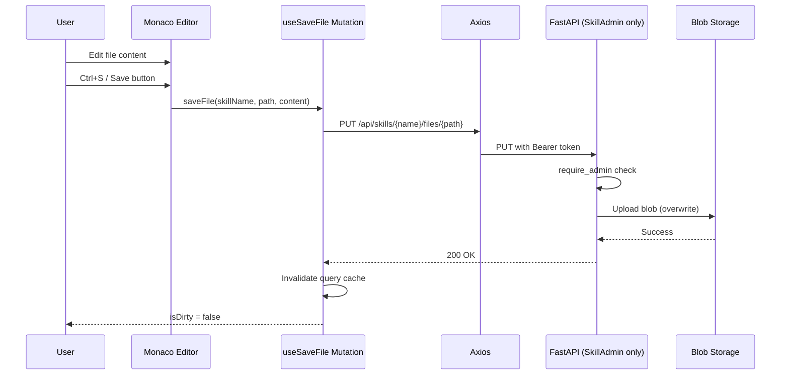
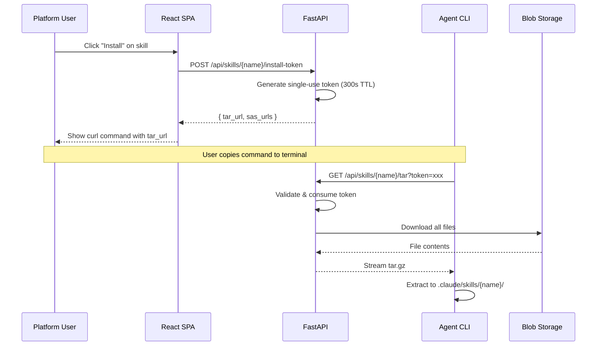

# Architecture Overview

## System Architecture



## Data Flow

### Read Path (List / View Skills)



### Write Path (Edit + Save File)



### Install Path (Agent Downloads Skill)



## Directory Structure

```
agent-platform/
├── backend/
│   ├── app/
│   │   ├── auth/
│   │   │   └── dependencies.py    # JWT validation + RBAC
│   │   ├── models/
│   │   │   └── skill.py           # Pydantic request schemas
│   │   ├── routers/
│   │   │   └── skills.py          # 14 REST endpoints
│   │   ├── services/
│   │   │   ├── blob_storage.py    # Azure Blob CRUD
│   │   │   ├── install_token.py   # Single-use token store
│   │   │   └── skill_validator.py # Frontmatter validation
│   │   ├── config.py              # pydantic-settings
│   │   └── main.py                # FastAPI app factory
│   └── tests/
├── frontend/
│   ├── src/
│   │   ├── api/                   # Axios client + API functions
│   │   ├── auth/                  # MSAL config, hooks, provider
│   │   ├── components/
│   │   │   ├── layout/            # AppLayout, Sidebar
│   │   │   ├── skills/            # FileTree, SkillCard, etc.
│   │   │   └── ui/                # Breadcrumb, SearchInput, etc.
│   │   ├── hooks/                 # useSkills, useSkillFiles
│   │   ├── pages/skills/          # List, Detail, Create, Editor
│   │   ├── types/                 # TypeScript interfaces
│   │   └── utils/                 # zipAssembler
│   └── package.json
├── docs/                          # Design specs and plans
└── wiki/                          # GitHub Wiki source
```

## Key Design Decisions

| Decision | Choice | Rationale |
|----------|--------|-----------|
| Storage | Azure Blob (no DB) | Skills are file collections, not relational data |
| Tenant isolation | Blob path prefix (`{tid}/`) | Simple, no extra DB needed, leverages JWT claim |
| Auth | Azure AD App Roles | Enterprise SSO, no custom user management |
| Install mechanism | Single-use token + tar stream | CLI agents can't do OAuth; short-lived tokens are secure |
| Editor | Monaco Editor | Same engine as VS Code; familiar to developers |
| State management | TanStack Query only | Server state is the source of truth; no local Redux needed |
