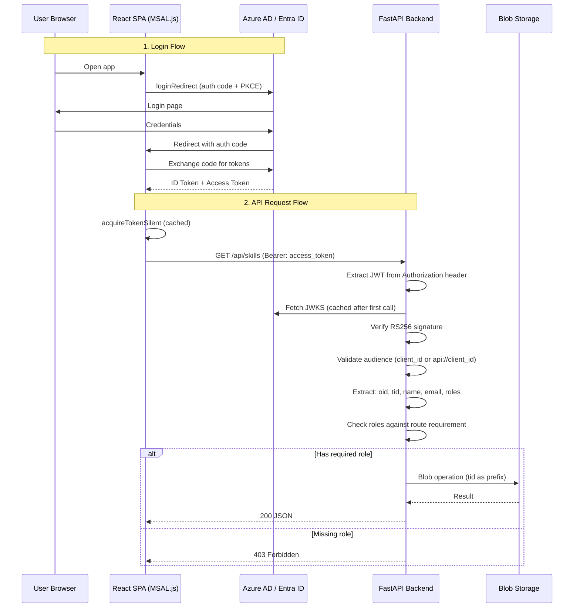

# Authentication Flow

Agent Platform uses **Azure AD (Entra ID)** for authentication and authorization. The frontend uses MSAL.js for interactive login; the backend validates JWT tokens with RS256 signature verification.

## End-to-End Auth Flow



## Azure AD App Registration

### Required Configuration

| Setting | Value |
|---------|-------|
| **Platform** | Single-page application (SPA) |
| **Redirect URI** | `http://localhost:5173` (dev), production URL |
| **Implicit grant** | Disabled (uses auth code + PKCE) |
| **API scope** | `api://{client-id}/Skills.ReadWrite` |

### App Roles

Two roles must be defined in the App Registration manifest:

```json
"appRoles": [
  {
    "displayName": "Skill Administrator",
    "value": "SkillAdmin",
    "allowedMemberTypes": ["User"]
  },
  {
    "displayName": "Skill User",
    "value": "SkillUser",
    "allowedMemberTypes": ["User"]
  }
]
```

Assign roles to users via **Enterprise Applications** → your app → **Users and groups**.

## Frontend Auth (MSAL.js)

### Configuration

[`frontend/src/auth/msalConfig.ts`](https://github.com/carvychen/agent-platform/blob/main/frontend/src/auth/msalConfig.ts)

| Setting | Value |
|---------|-------|
| Client ID | `VITE_AZURE_AD_CLIENT_ID` |
| Authority | `https://login.microsoftonline.com/{VITE_AZURE_AD_TENANT_ID}` |
| Cache location | `sessionStorage` |
| Login scope | `api://{clientId}/Skills.ReadWrite` |

### AuthProvider

[`frontend/src/auth/AuthProvider.tsx`](https://github.com/carvychen/agent-platform/blob/main/frontend/src/auth/AuthProvider.tsx)

Initialization sequence:
1. Create `PublicClientApplication` singleton
2. Call `initialize()` → `handleRedirectPromise()`
3. Set active account from redirect response or cache
4. Listen for `LOGIN_SUCCESS` events
5. Render `<MsalProvider>` wrapper

### Token Acquisition

[`frontend/src/api/axiosClient.ts`](https://github.com/carvychen/agent-platform/blob/main/frontend/src/api/axiosClient.ts)

```
Every API request → Axios interceptor
  → Check token cache (valid if expiry > 60s away)
  → If expired: acquireTokenSilent (with inflight dedup)
  → Attach Authorization: Bearer <token>
```

## Backend Auth (JWT)

### JWT Validation

[`backend/app/auth/dependencies.py`](https://github.com/carvychen/agent-platform/blob/main/backend/app/auth/dependencies.py)

Steps performed on every authenticated request:

1. Extract Bearer token from `Authorization` header
2. Fetch Azure AD JWKS public keys (cached in process memory)
3. Match JWT `kid` header to signing key
4. Decode with RS256 verification
5. Validate audience (`azure_ad_audience` or `azure_ad_client_id`)
6. Require `tid` (tenant ID) claim
7. Build `UserInfo(oid, tenant_id, name, email, roles)`

### Role Enforcement

```python
# Factory pattern for role checks
def require_role(*allowed_roles):
    def dependency(user: UserInfo = Depends(get_current_user)):
        if not any(r in user.roles for r in allowed_roles):
            raise HTTPException(403, "Insufficient permissions")
        return user
    return Depends(dependency)

# Pre-built dependencies
require_admin    = require_role("SkillAdmin")
require_any_role = require_role("SkillAdmin", "SkillUser")
```

### Route Protection Matrix

| Endpoint | Required Role |
|----------|--------------|
| `GET /api/health` | None |
| `GET /api/me` | Any authenticated user |
| `GET /api/skills` | SkillAdmin or SkillUser |
| `GET /api/skills/{name}` | SkillAdmin or SkillUser |
| `GET /api/skills/{name}/files/{path}` | SkillAdmin or SkillUser |
| `GET /api/skills/{name}/download` | SkillAdmin or SkillUser |
| `GET /api/skills/{name}/tar?token=` | None (token-gated) |
| `POST /api/skills/{name}/install-token` | SkillAdmin or SkillUser |
| `POST /api/skills/{name}/validate` | SkillAdmin or SkillUser |
| `POST /api/skills` | SkillAdmin only |
| `POST /api/skills/import` | SkillAdmin only |
| `PUT /api/skills/{name}/files/{path}` | SkillAdmin only |
| `DELETE /api/skills/{name}` | SkillAdmin only |
| `DELETE /api/skills/{name}/files/{path}` | SkillAdmin only |

## Tenant Isolation

All data access is scoped by the `tid` claim from the JWT:

```
Blob path: {tenant_id}/{skill_name}/{file_path}
```

- Users from Tenant A cannot access Tenant B's skills
- The tenant ID is extracted from the JWT, not from user input
- Even the install token system preserves tenant isolation (token carries `tenant_id` internally)
