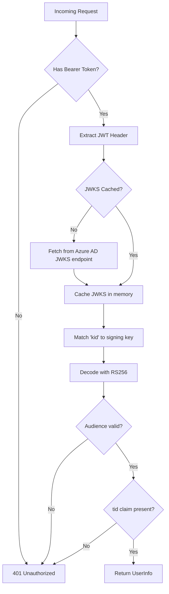

# Backend Guide

The backend is a **Python FastAPI** application that serves as the API layer between the React frontend and Azure Blob Storage. It handles authentication, authorization, skill CRUD operations, and file management.

## Application Entry Point

[`backend/app/core/main.py`](https://github.com/carvychen/agent-platform/blob/main/backend/app/core/main.py)

The FastAPI app is configured with:
- **CORS Middleware** — configurable origins via `CORS_ORIGINS` env var, defaults to `["http://localhost:5173"]`
- **Two route groups**: system routes (`/api/health`, `/api/me`) and the skills router (`/api/skills/...`)

## Configuration

[`backend/app/core/config.py`](https://github.com/carvychen/agent-platform/blob/main/backend/app/core/config.py)

Uses `pydantic-settings` to load from `.env`:

```python
class Settings(BaseSettings):
    blob_account_url:    str = ""    # Azure Blob Storage endpoint
    blob_account_name:   str = ""    # For SAS URL generation
    blob_container_name: str = "skills-container"
    azure_ad_tenant_id:  str = ""
    azure_ad_client_id:  str = ""
    azure_ad_audience:   str = ""
    cors_origins:        list[str] = ["http://localhost:5173"]
```

## Authentication & Authorization

[`backend/app/core/auth/dependencies.py`](https://github.com/carvychen/agent-platform/blob/main/backend/app/core/auth/dependencies.py)

### JWT Validation Flow



### RBAC Model

Two roles defined as Azure AD App Roles:

| Role | Read | Download | Create | Edit | Delete |
|------|------|----------|--------|------|--------|
| `SkillAdmin` | Yes | Yes | Yes | Yes | Yes |
| `SkillUser` | Yes | Yes | No | No | No |

Enforced via dependency injection:

```python
require_admin    = require_role("SkillAdmin")
require_any_role = require_role("SkillAdmin", "SkillUser")
```

### UserInfo Dataclass

Extracted from JWT claims:

| Field | JWT Claim | Description |
|-------|-----------|-------------|
| `oid` | `oid` | Azure AD Object ID |
| `tenant_id` | `tid` | Tenant ID (used for data isolation) |
| `name` | `name` | Display name |
| `email` | `preferred_username` | Email address |
| `roles` | `roles` | App Role assignments |

## Service Layer

### BlobStorageService

[`backend/app/skills/service.py`](https://github.com/carvychen/agent-platform/blob/main/backend/app/skills/service.py)

The primary data access layer. Uses `DefaultAzureCredential` for authentication.

**Blob naming convention:**
```
{tenant_id}/{skill_name}/{file_path}
```

This path structure provides tenant isolation — each Azure AD tenant's skills are namespaced under their tenant ID.

**Key methods:**

| Method | Description |
|--------|-------------|
| `list_skills(tenant_id)` | List all skills by scanning blob prefixes |
| `get_skill(tenant_id, name)` | Get skill metadata by parsing SKILL.md frontmatter |
| `create_skill(tenant_id, name, files)` | Upload multiple files in parallel (ThreadPoolExecutor, max 8 workers) |
| `read_file(tenant_id, name, path)` | Read single blob content |
| `write_file(tenant_id, name, path, content)` | Create or overwrite a blob |
| `delete_file(tenant_id, name, path)` | Delete a single blob |
| `rename_file(...)` | Copy blob to new path, then delete old |
| `delete_skill(tenant_id, name)` | Delete all blobs under a skill prefix |
| `download_all_files(tenant_id, name)` | Download all files in parallel for tar/zip streaming |
| `generate_sas_urls(tenant_id, name)` | Generate read-only SAS URLs (5min TTL) via user delegation key |

**SKILL.md Frontmatter Parser:**
```python
@staticmethod
def parse_skill_md(content: str) -> dict:
    # Splits on '---' delimiters, parses YAML middle section
    # Returns {} on malformed or invalid YAML
```

### InstallTokenStore

[`backend/app/skills/install_token.py`](https://github.com/carvychen/agent-platform/blob/main/backend/app/skills/install_token.py)

In-memory token store for unauthenticated tar downloads:

- **Token generation**: `secrets.token_urlsafe(32)` (256-bit)
- **TTL**: 300 seconds (5 minutes)
- **Single-use**: Token is deleted on first consumption
- **Lazy cleanup**: Expired tokens are purged when new tokens are created

> Note: Tokens do not survive server restarts. Not suitable for multi-worker deployments without external state.

### SkillValidator

[`backend/app/skills/validator.py`](https://github.com/carvychen/agent-platform/blob/main/backend/app/skills/validator.py)

Validates skill names and SKILL.md frontmatter:

**Name rules:**
- 1–64 characters
- Lowercase alphanumeric + hyphens only
- No leading/trailing hyphens
- No consecutive hyphens

**Frontmatter validation:**
- `name` required, must match directory name
- `description` required, max 1024 chars
- `compatibility` optional (warning if absent)

## Data Models

[`backend/app/skills/models.py`](https://github.com/carvychen/agent-platform/blob/main/backend/app/skills/models.py)

```python
class SkillCreateRequest(BaseModel):
    name:        str             # 1-64 chars
    description: str             # 1-1024 chars
    template:    str             # blank | script | instruction | mcp
    license:     str | None
    metadata:    dict[str, str] | None

class FileWriteRequest(BaseModel):
    content: str

class FileRenameRequest(BaseModel):
    new_path: str               # min_length=1
```

## Skill Templates

Four built-in templates generate initial file structures:

| Template | Files Generated | Use Case |
|----------|----------------|----------|
| `blank` | SKILL.md + empty dirs | General purpose |
| `script` | SKILL.md + `scripts/main.py` + reference doc | Multi-script API integration |
| `instruction` | SKILL.md + reference dir | Prompt engineering (no scripts) |
| `mcp` | SKILL.md + `scripts/client.py` + API reference | External API / MCP server calls |
