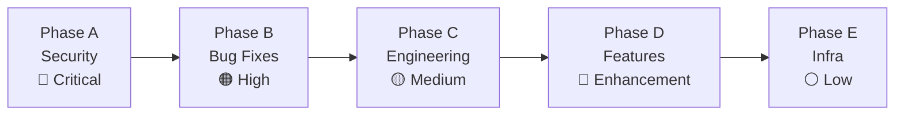

# Development Roadmap

The MVP is complete. The current plan focuses on hardening the platform to production quality through 5 sequential phases.

## Phase Overview

## Phase A — Security Hardening (Critical)

All items block production deployment.

| ID | Issue | File |
|----|-------|------|
| A.1 | JWT audience validation bypassed (`verify_aud=False`) | `backend/app/core/auth/dependencies.py` |
| A.2 | Path traversal in blob operations (no `../` normalization) | `backend/app/skills/service.py` |
| A.3 | XSS via raw HTML in Markdown (`rehype-raw` enabled) | `frontend/src/components/skills/MarkdownRenderer.tsx` |
| A.4 | JWKS cache never invalidates (key rotation breaks auth) | `backend/app/core/auth/dependencies.py` |
| A.5 | No file upload size limit | `backend/app/skills/models.py` |
| A.6 | CORS too permissive (`allow_methods=["*"]`) | `backend/app/core/main.py` |
| A.7 | Reserved skill names defined but not enforced | `backend/app/skills/router.py` |

## Phase B — Bug Fixes

| ID | Issue | File |
|----|-------|------|
| B.1 | Can't save empty files (`!editorContent` check) | `SkillEditorPage.tsx:106` |
| B.2 | React Query refetch overwrites unsaved editor content | `SkillEditorPage.tsx:98-103` |
| B.3 | Escape key cancel in rename triggers onBlur submit | `FileTree.tsx:192-201` |
| B.4 | Frontmatter strip regex breaks on `---` in Markdown body | `MarkdownRenderer.tsx:53-57` |
| B.5 | Auth tests not updated for `tenant_id` field | `test_auth.py` |
| B.6 | Blob storage tests reference renamed `_user_prefix` | `test_blob_storage.py` |
| B.7 | Optimistic updates missing `onSettled` cache invalidation | `useSkillFiles.ts` |
| B.8 | Silent token failure sends request without auth | `axiosClient.ts:39` |

## Phase C — Engineering Improvements

| ID | Improvement | Description |
|----|------------|-------------|
| C.1 | `ProtectedRoute` wrapper | Replace per-page admin redirect logic |
| C.2 | "Coming Soon" pages | Placeholder pages for Agents, Prompts, MCP nav items |
| C.3 | N+1 query fix | `list_skills()` currently reads SKILL.md per skill individually |
| C.4 | Error format consistency | Standardize API error responses |
| C.6 | Error boundaries | Add React error boundaries for resilience |
| C.7 | Loading/error states audit | Ensure all pages handle loading and error states |

## Phase D — Feature Enhancements

| ID | Feature | Description |
|----|---------|-------------|
| D.1 | Pagination | Paginate skill list for large tenants |
| D.2 | Filter dropdown | Filter skills by template, license, author |
| D.3 | Dynamic preview | Live SKILL.md preview in creation wizard |
| D.4 | Author auto-fill | Pre-fill author from Azure AD profile |
| D.5 | Multi-tab editor | Open multiple files simultaneously |
| D.6 | File upload | Upload binary files to skills |
| D.7 | Cursor position | Show line/column in editor status bar |
| D.8 | Sticky panel | Sticky right panel on detail page |
| D.9 | Heading anchors | Clickable heading links in Markdown preview |
| D.10 | Unsaved changes warning | Browser prompt when navigating away with unsaved edits |
| D.11 | Keyboard shortcuts | Overlay showing available shortcuts |

## Phase E — Infrastructure

| ID | Improvement | Description |
|----|------------|-------------|
| E.1 | Enhanced health check | Include Blob Storage connectivity in `/api/health` |
| E.2 | Structured logging | JSON-formatted logs with request correlation |

## Out of Scope

The following are explicitly deferred:
- Agents module
- Prompts module
- MCP Servers module
- Version control / Git integration
- Publish / review workflow
- Full-text search
- Team collaboration features
- Usage analytics
- External consumer API
