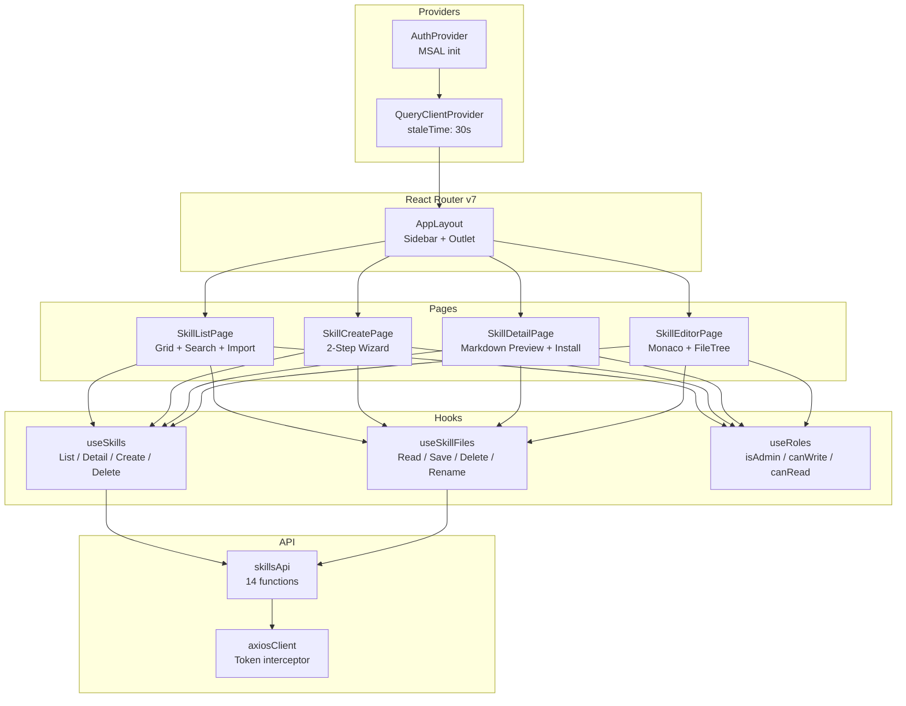
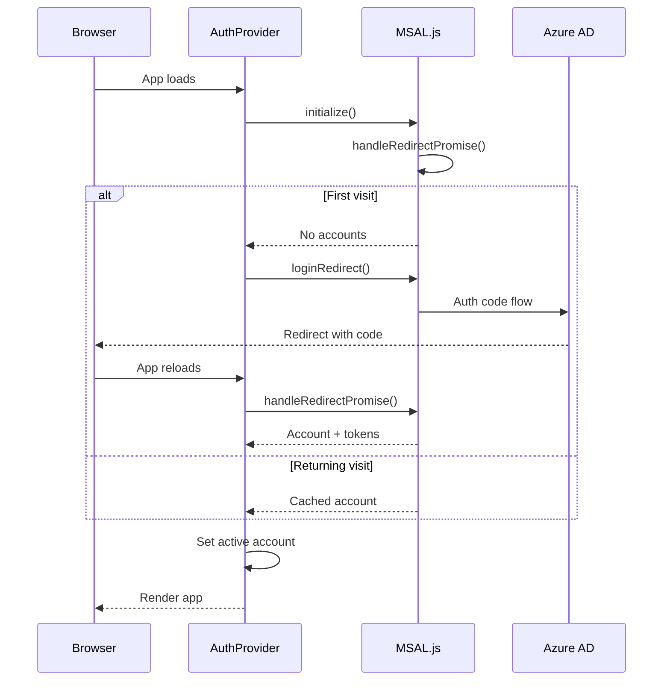

# Frontend Guide

The frontend is a **React 19 SPA** built with Vite 8 and TypeScript. It provides a developer studio experience for managing skills.

## Component Architecture

## Pages

### SkillListPage (`/skills`)

[`frontend/src/pages/skills/SkillListPage.tsx`](https://github.com/carvychen/agent-platform/blob/main/frontend/src/pages/skills/SkillListPage.tsx)

- **Grid layout** of `SkillCard` components (3 columns)
- **Search** by skill name with debounced filtering
- **New Skill** button (admin only) + **Import** dropdown (ZIP or folder)
- **Empty state** with call-to-action when no skills exist
- **Import dialog** with conflict detection (409 → overwrite confirmation)

### SkillCreatePage (`/skills/new`)

[`frontend/src/pages/skills/SkillCreatePage.tsx`](https://github.com/carvychen/agent-platform/blob/main/frontend/src/pages/skills/SkillCreatePage.tsx)

- **2-step wizard**: Template selection → Form input
- **4 templates**: Blank, Script, Instruction, MCP
- **Form validation** with React Hook Form + Zod schema
- Redirects non-admin users back to `/skills`

### SkillDetailPage (`/skills/:name`)

[`frontend/src/pages/skills/SkillDetailPage.tsx`](https://github.com/carvychen/agent-platform/blob/main/frontend/src/pages/skills/SkillDetailPage.tsx)

- **Markdown preview** of SKILL.md with GitHub-style rendering
- **Metadata pills**: license, compatibility, author, version
- **File tree** (read-only) with file count and total size
- **Export dropdown**: ZIP download + per-agent install commands
- **Install guide** sidebar: step-by-step for 6 AI agents

### SkillEditorPage (`/skills/:name/edit`)

[`frontend/src/pages/skills/SkillEditorPage.tsx`](https://github.com/carvychen/agent-platform/blob/main/frontend/src/pages/skills/SkillEditorPage.tsx)

- **Monaco Editor** with custom light theme and language detection
- **Interactive file tree**: create, rename, delete files/folders; context menu
- **Keyboard shortcut**: Cmd+S / Ctrl+S to save
- **Dirty state tracking** with visual indicator
- **Validate button**: checks SKILL.md frontmatter compliance

## Key Components

### FileTree

[`frontend/src/components/skills/FileTree.tsx`](https://github.com/carvychen/agent-platform/blob/main/frontend/src/components/skills/FileTree.tsx)

Interactive file tree with:
- Right-click context menu (New File, New Folder, Rename, Delete)
- Inline rename with auto-selected filename
- Protected paths (SKILL.md cannot be renamed/deleted)
- Hover quick-add button on directories
- Expand/collapse directories

### MarkdownRenderer

[`frontend/src/components/skills/MarkdownRenderer.tsx`](https://github.com/carvychen/agent-platform/blob/main/frontend/src/components/skills/MarkdownRenderer.tsx)

- `react-markdown` + `remark-gfm` + `rehype-raw`
- Strips YAML frontmatter before rendering
- Syntax-highlighted code blocks with copy button (Prism `oneLight` theme)
- GitHub-style typography via `github-markdown-css`

### ExportDropdown

[`frontend/src/components/skills/ExportDropdown.tsx`](https://github.com/carvychen/agent-platform/blob/main/frontend/src/components/skills/ExportDropdown.tsx)

- ZIP download + per-agent `curl | tar` install commands
- Install token pre-fetched on dropdown open
- 4-minute client-side token cache
- Supports 6 agents: Claude Code, Copilot, Codex, Cursor, Windsurf, OpenCode

## State Management

All server state is managed by **TanStack Query v5**. No Redux, Zustand, or Context (beyond MSAL).

### Query Keys

| Key | Data | Stale Time |
|-----|------|------------|
| `["skills"]` | Full skill list | 30s |
| `["skills", name]` | Skill detail + files | 30s |
| `["skill-file", name, path]` | File content | 30s |
| `["current-user"]` | User info + roles | 5min |

### Mutation Patterns

- **Standard**: `useCreateSkill`, `useDeleteSkill`, `useImportSkill` → invalidate `["skills"]` on success
- **Optimistic**: `useDeleteFile`, `useRenameFile` → immediate UI update with rollback on error
- **File save**: `useSaveFile` → invalidates both file key and detail key

## Authentication

### MSAL Integration

[`frontend/src/auth/`](https://github.com/carvychen/agent-platform/blob/main/frontend/src/auth/)

### Token Management

The Axios client ([`axiosClient.ts`](https://github.com/carvychen/agent-platform/blob/main/frontend/src/api/axiosClient.ts)) implements:
- **Token caching**: 60-second expiry buffer before refresh
- **Inflight deduplication**: Single concurrent `acquireTokenSilent` call
- **Request interceptor**: Attaches `Authorization: Bearer <token>` to every request

## Styling

- **Tailwind CSS v4** with `@tailwindcss/vite` plugin
- **Design tokens** defined in `index.css` via CSS custom properties
- **Fonts**: DM Sans (body), JetBrains Mono (code/editor)
- **Icons**: lucide-react (inline SVG components)
- **Markdown**: github-markdown-css for SKILL.md rendering

## Supported Agents

Defined in [`frontend/src/constants/agents.ts`](https://github.com/carvychen/agent-platform/blob/main/frontend/src/constants/agents.ts):

| Agent | Project Path | Personal Path |
|-------|-------------|---------------|
| Claude Code | `.claude/skills/{name}/` | `~/.claude/skills/{name}/` |
| Copilot | `.github/skills/{name}/` | — |
| Codex | `.codex/skills/{name}/` | `~/.codex/skills/{name}/` |
| Cursor | `.cursor/skills/{name}/` | `~/.cursor/skills/{name}/` |
| Windsurf | `.windsurf/skills/{name}/` | `~/.windsurf/skills/{name}/` |
| OpenCode | `.opencode/skills/{name}/` | `~/.opencode/skills/{name}/` |
