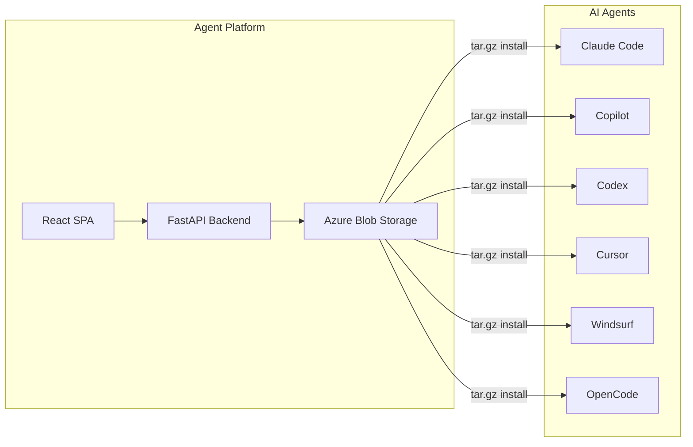

# Agent Platform

> A developer-focused customization hub for creating and managing AI agent Skills conforming to the [agentskills.io](https://agentskills.io) open standard.

## What is Agent Platform?

Agent Platform is a full-stack web application that lets teams **create, edit, validate, and distribute portable skill packages** for AI coding agents. Skills are self-contained directories of instructions, scripts, and reference documents that extend agent capabilities.

## Key Features

| Feature | Description |
|---------|-------------|
| **Skill CRUD** | Create from templates, edit with Monaco Editor, delete, import/export |
| **Multi-Agent Install** | One-click install commands for 6 AI coding agents |
| **RBAC** | Azure AD App Roles (SkillAdmin / SkillUser) |
| **Tenant Isolation** | Skills scoped by Azure AD tenant via Blob Storage prefixes |
| **Validation** | agentskills.io frontmatter compliance checks |
| **Import/Export** | ZIP upload/download and folder import with conflict detection |

## Tech Stack

| Layer | Technology |
|-------|-----------|
| Frontend | React 19, TypeScript, Vite 8, Tailwind CSS 4, Monaco Editor |
| Backend | Python, FastAPI, Azure Blob Storage SDK |
| Auth | Azure AD / Entra ID (MSAL.js + JWT) |
| Data | Azure Blob Storage (single container, tenant-prefixed) |

## Quick Navigation

- [[Architecture Overview]] — System design and component diagrams
- [[Getting Started]] — Development environment setup
- [[Backend Guide]] — FastAPI routes, services, and auth
- [[Frontend Guide]] — React components, hooks, and state management
- [[Authentication Flow]] — Azure AD integration details
- [[Skills Data Model]] — The agentskills.io standard and skill structure
- [[API Reference]] — Complete REST API documentation
- [[Agent Integration]] — How skills are installed into AI agents
- [[Development Roadmap]] — Planned phases and improvements
